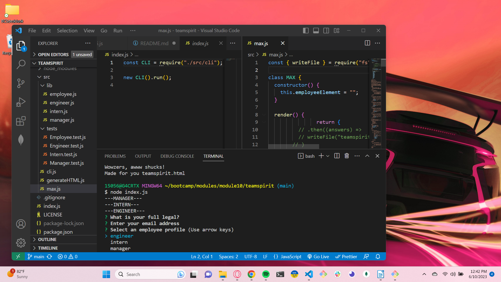

# Teamspirit

## Description:  
* To generate a team list of employees and their roles using a command line interface.
* Using a preset list of questions, an HTML page is generated based upon input, bypassing the need to modify HTML or javascript code.
* By invoking a simple command on the terminal, a new roster will be created after the user answers questions, no need to know or modify code.
* The code is generalized for a company, however, may be modified to be applicable to many types of teams or workforces that have individuals assigned different roles.


## Installation

https://github.com/gdutra2002/teamspirit

* Clone the code from github.
* Open a terminal in VSCode.
* Invoke the program using the command: node index.js 

```bash
node index.js
```
* Answer the command propts to generate a roster html file.

* To test new / added features, use the command npm run test at the terminal to invoke jest.

```bash
npm run test
```

## Usage
>
> **Note**:
* Video URL
* https://drive.google.com/file/d/1-UkSeK_D515UGTRdz6Ug215GaX7Rf0Ic/view
* Sample HTML file



(https://github.com/gdutra2002/teamspirit/blob/main/dist/teamspirit.html)

(https://gdutra2002.github.io/teamspirit/)


## Credits
UCD FullStack Bootcamp is credited with the scope of the project design.

## License
  <br>
See MIT license


## Badges


### Features
>
>* HTML, CSS, github, npm inquery, jest, terminal, JavaScript, Node.js
>

## How to Contribute
Prefered method of contact: Linked-In.  <br>
Link to source:
https://github.com/gdutra2002    <br>
Contact author:  <br>
Profile
https://www.linkedin.com/in/gary-e-dutra-15357940/

---
© 2023 MRB Confidential and Proprietary. All Rights Reserved.

